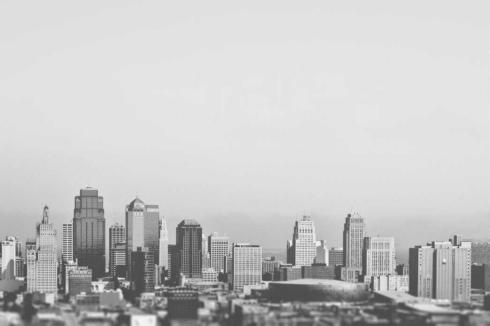
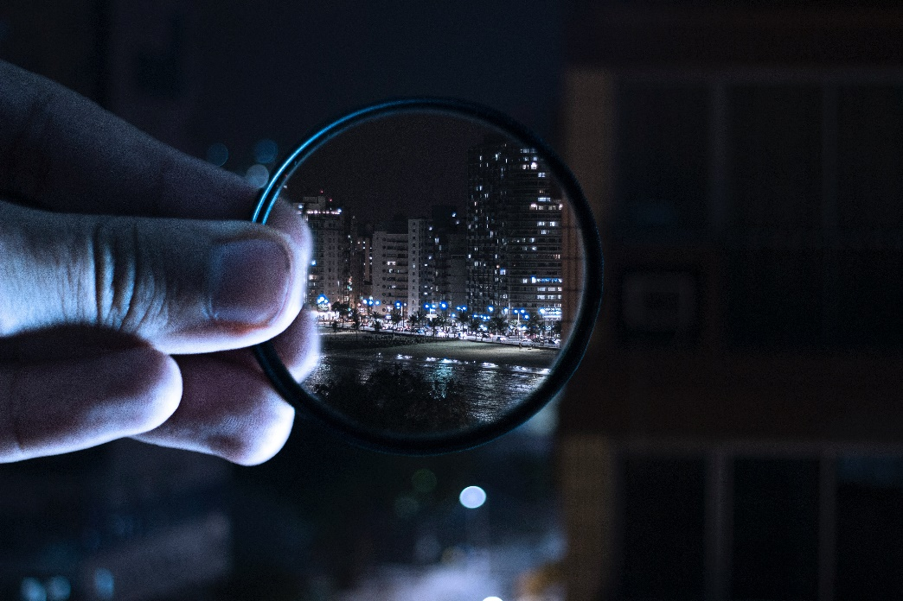
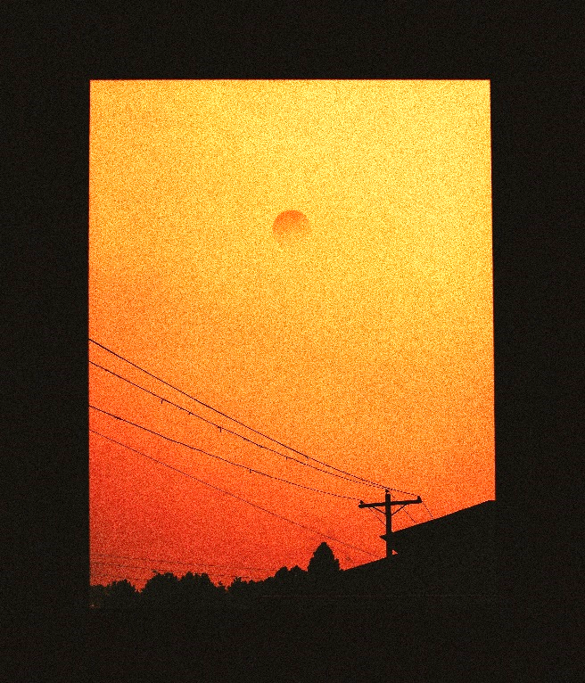

# 随笔

<iframe width="100%" height="200" scrolling="no" frameborder="no" allow="autoplay" src="https://w.soundcloud.com/player/?url=https%3A//api.soundcloud.com/playlists/2441273&color=%231e988e&auto_play=true&hide_related=false&show_comments=true&show_user=true&show_reposts=false&show_teaser=true"></iframe>
<a href="https://soundcloud.com/mitis" title="MitiS" target="_blank" style="color: #cccccc; text-decoration: none;">MitiS</a> · <a href="https://soundcloud.com/mitis/sets/free-downloads" title="Free Downloads!" target="_blank" style="color: #cccccc; text-decoration: none;">Free Downloads!</a>

## I

无尽的阴郁将光线吞没，沉默着，却隆隆作响。

人们并不清楚自己的祖先从什么时候就已经出现了，也从不追究历史长河中究竟丧失了多少人。“寿命”就如同上帝给人们戴上的枷锁，但也如同流水一般，将万物更迭。新的事物以及思想因此不断地被创造。

弗莱格听闻村里面的老人说，每个人的一辈子都是上天注定的，无论历史怎样顺延，每一个前进的步伐都好像是提前写入了剧本。老人同时哀叹自身的渺小与对未来的迷茫无力。当然，弗莱格本人是不太相信这些的。他觉得很多东西可以被上天注定，唯独命运不可以。每个人应当有着创造自己命运的能力与责任。因此，他也并不是一个循规蹈矩的人。他不希望每次站在河畔，山崖边的时候，看河流永远流向一个方向，看太阳照常起落，就如同再看一遍尘封的录像带一样。

在他的某次散步时，偶然间发现了一个披头散发的人站在一个太阳照不进的小角落里，在不断自言自语说着什么。弗莱格很好奇，站在原地想要弄清楚他究竟在做什么。正在这时，那怪人似乎事先察觉到了什么，没当弗莱格缓过神来的时候便微微转头朝向了他——那是一位面容清秀的大叔。他的目光很温柔，望久了就好像整个人都能陷进他的瞳孔一般。大叔直截了当：

“我其实要做一个演讲，我不是很确定我的发挥会不会像上次那样出现事故——当然，我对自己的话题百分百有信心，只是有时候脑子不太好使罢了。”

弗莱格受到了吸引，“那是关于什么的？”

“话题看起来比较大，是有关人的精神的。”

“那确实。不妨和我说说？”

“好吧。人实际上还是感性的生物。水平越是低下越是容易做出非理性的事情来。当然，那些研究员也不能避免，即使他们研究的是最严谨的事物。不知道你听没听说过，东边的沧国有一位君主，他的身体不太好。去年病情转危的时候，周边的几个国郡都在喝酒庆祝；这个国家最近因为旱灾导致粮食大减产，有的国家甚至将这个数字登上头条专门来嘲笑。是沧不够强大吗？不，这个国家强大到难以想象，而且还非常愿意帮助周边的国家。”

“那他们为什么恩将仇报呢？”弗莱格疑惑。

“那些小国的各种恶劣风气也不知道跟谁学的。其实我们都清楚应该对帮助自己的人抱有感激，但是总有一些人有着很大的野心，总是觉得自己比别人更高一等，打着正义的旗号对自认为的威胁虎视眈眈。”

“看来人还是永远摆脱不了这些坏习惯。”

“是。不仅如此，那些国家还将真相隐瞒，彻底将民众作为本国的傀儡。那些民众同样自认为自己在捍卫自己的国家，实际上在别人眼里和老鼠一样肮脏。”

“这听起来真不幸。怎么会有这样的事情发生？我们没有能力阻止吗？”

“无能为力。你休想去撼动他们。这也是人的精神的一部分。”

“精神一般不是用来形容正面的东西吗？”

“你可能不太容易理解。或者说，正面和反面合起来才能称作是人。用来宣扬的正面精神不过是自欺欺人，如果每个人都学同一个人的作为，并且有人说：人就应该这样做。这就是可耻的。曦国人也同样奉行着一套所谓高尚精神，我们都知道曦国人的面具下尽是虚伪和虚荣。”

“我不太赞同…”

“但是你看有几个人真的照常复刻出那种所谓‘精神‘了？世界不是该怎样就怎样吗？”

“现在我想明白了一点，别人的心理我们是不能够看得见的。这让我想起了我的朋友喜欢一边做着曦国流行的礼貌微笑，一边用很怪的语气嘲弄商贩，后来那商贩一看到那样笑的客人就心情不好。”

大叔拍着弗莱格的肩膀说：“嗯，礼貌的微笑本身并没有罪过，罪过全在个人那邪恶的心啊。不过你不需要因此垂头丧气，觉得人类真的没有希望了。思考久了的时候千万不要因此丧失在苦痛的现实里…”

“你不整理一下你的头发吗？”弗莱格突然打断大叔的话。

说起来，是这样的。大叔对这些毫无兴趣。“我不习惯呆在家里，每天一大早，我都要到这里来，思考一些可能比较难懂的问题，兴许能找到一些灵感。这不，你就是我的灵感。我还要计划把我的经历写成书，然后…”

“搞文学艺术的多是疯子。”弗莱格又一次打断大叔。

当然，大叔对这一点毋庸置疑，甚至还乐在其中。周围人每天都在密切的关注新闻时事，为自己的生活劳累奔波，不时喜欢讨论一些八卦，好像是没有什么时间像大叔一样思考这些看似不切实际的东西了。“但是一个疯子的世界，同样也可以是丰富多彩的。”

“真的吗？不会有困扰吗？”

“有，但是那取决于看待问题的角度。至少如此的活着不会常常感到空虚。这里的人常常把自然的‘恩赐’看作是高悬的利刃。无论是烈日还是细雨，他们好像都喜欢撑着一把伞。”

“我喜欢雨。可是以前的时候每当下雨时都会伴随着一些不愉快的事情发生——不过后来想想，那不过是因为自己的粗心和无端愤怒罢了。”

正说着，方才阴沉的天空在远方打了几声响雷，淅淅沥沥的雨点从云端滑落下来，如针如丝，小到几乎感觉不到下雨，只觉得地面被越来越密集的雨迹填充。恍惚间，能够望见大叔在他原来所在的角落里支起了一个简易的小顶篷，范围刚好容下两个人。

“先过来吧，这雨马上就会下得很大！省的湿透了。”大叔招手示意。

弗莱格连忙过去，和大叔坐在一起。雨从顶棚上划至边缘，滴落在他们身前。他抬起头，凝视着不断胀满又下坠的雨滴。 上次这样凝视时已经不知道是多少年前了。

## II 

两人坐在顶棚下，雨牵丝成珠，落在地面上的动静也越来越大。阴沉的天空让人感觉像到了几个小时后的日暮。灰色的天空映照着人们灰色的心情。

房檐下不知是谁遗落的玻璃杯，被大颗雨滴有节律的敲打，发出清脆悦耳的声音。

大叔此时似乎很享受这种声音。在他的印象里，第一次认真聆听雨滴敲打物体的声音是在五岁左右。那时，他很快就被这些声音所折服了，并且不断期待那场雨能够下的久一点。兴奋处，他竟不顾家里人的劝导，冲进雨幕中，想要跟自然来一个深情的拥抱——当然，雨滴显得有些过于粗暴，打在身上很疼。环顾四周，感觉好像真的是老天爷用装满雨水的盆子泼下来，也好像是一个巨大的花洒，不见花洒模样，但水流也足够强劲。满身湿漉漉的他退回了屋里，意犹未尽。但他也不敢再出去一趟了。

换好衣服后擦干，躺在床上，雨声一点也不感觉嘈杂。他感觉有什么东西在摇晃他，缓缓地睁开眼，有些恍惚，“我刚才睡着了吗？”

“不确定。你刚才靠着墙，闭着眼，还面带微笑的。”

“好吧，那我的确是睡着了，刚才想一些东西入迷了。”

此时，外面雨下的其实并不大，稀稀落落的，太阳也在云里若隐若现，偶尔能有几束强光照射在面前的空地里，又迅速消失。

“应该很快就不下了，”弗莱格指了指天上的几块乌云，“真希望它们很快就能被风吹跑啊。”

“嗯，话说近几年里很少下特别大的雨了，我还有点怀念以前呢。”

“是嘛。”

“可天就是下不痛快。”

“我还记得在学校的时候，临近放学，本来应该晴空万里的美好下午突然狂风大作，乌云很快的积压上来。”

“那确实很少见。”

“直到天黑成了午夜，电闪雷鸣，风雨大作。我还能看到在外面射灯的照耀下，雨的轨迹被吹成了一条曲线。”

“就像是世界末日。”

“对，我当时很害怕。”

“我就从不害怕。”

“为什么？”

“因为强烈的事物存在时间一般很短暂，”大叔摸了摸弗莱格的头，“无论下了多大的雨，只要能稍微等一等，不久就能看到天空放晴了。有重见阳光的希望，再深的黑暗里也能够步伐坚定”

“这样啊。”

大叔抬头看了看天空，“时候不早了，我得去忙重要的事情了。”正说着，将顶棚收起来，简单的卷了卷，扔在了那个角落里。随后整了整衣服，戴上帽子，步履匆匆，沿着格林大街边缘走去。

“回头见！”弗莱格对着远处的人影说道。

此时已然是黄昏时分。弗莱格并不明白那人为何走的那么匆忙，但那总归和自己没有关系。他叹了口气，向附近选择了一处小吃店的桌椅坐了下来。服务员将菜单递给了他：“您要点什么？阁下。”

弗莱格随意浏览了一下目录，并不感兴趣。皱了皱眉头，索性点了一碗牛肉汤面，一碟群英荟萃。服务员点点头，将走时，弗莱格添了一句：“别忘了一瓶大麦酒！”

服务员应着，不一会跑到别处去了。在这个空当正无聊时，对街奏起了笙歌。他饶有兴趣地看过去，那是一位诗人。

诗人有感情的诵道：

“广袤的大地！正在遥望九天点点星光！

“星光闪耀，投下的银纱在夜中做了装点。

曲声舒缓而悠扬，让人不禁沉醉。

“大地沉睡了，而星河却愈发闪耀了。

“星对地的依恋，在朝阳升起时弥高。

“星不躲夜色，地不曾醒来。

“或许，地更喜欢烈阳，却抱怨星的冷傲。

“那是冷光，决不同于日光的暖色。

“冷光声嘶力竭的呐喊，永远不及日的炙烤。

“但——他有日光没有的东西。

“那是自然的馈赠，也是暗淡中的倚靠。

面被端上了桌，弗莱格只是听得入迷——此时音乐转为凄凉：

“平凡的生活中，阴云常驻，星变得卑微。

“是‘人生代代无穷已，江月年年只相似’的隐隐愁绪。

“没了星坚定的驻守，

“企盼朝阳似乎也没了意义。

“冥冥之中，地似乎察觉到了远天空无一物的凄凉。

“无限愁绪凝成了颗颗露珠。

“积淀在草丛里，林中，泥土里。

“或许死，才能表现出自己坚守的价值。

听到这里，许多愁思似乎灌满了心头，但似乎也并不知道自己在愁思着什么。

“星河再次高高挂在天幕中

“那是地的凄美的梦。”

诗人停止了吟诵。诗人简单的收拾好了东西，准备坐在原地休息——这显然是一场排练。弗莱格有一种冲动。一种想要高喊什么的冲动。他想要在一个无人的地方，对着天空，对着远方大声倾诉。也完全不用顾忌什么。

弗莱格也并不明白，诗句如同有魔力一般。平常只是觉得可笑，但一旦认真起来，如同坚冰的内心也开始融化。他拿起筷子，很快的把面吃完。这碗面，吃的无比香甜可口。他问了问邻桌，“这诗人是谁啊？”

“他好像是第一次到这里来。听说是从曦国的方向一路驾车过来的。你问我——我也不知道。”

或许天涯沧茫之间，有同好相照，有友人知心，也是一种莫大的幸福吧。弗莱格这样感慨道。无论是星还是地，在诗人的描述中都饱含怅惘与失落。人是多么希望自己终其一生，都能够免于这些困扰。或许遗忘，是最后的解药吧。他拿起服务员刚上的大麦酒，熟练的启了瓶盖，倒在杯子中，一饮而尽。万千思绪也随之咽回肚中。

夜幕降临，整条街上不约而同地亮起了各种颜色的彩灯。巨大显示屏的光投射到地面，雨后留下的小水坑映出了清晰的倒影。几只流浪的狸猫穿过光径，在粗糙的路面投射出一块块影子。它们走到路灯下停住，舔舐着爪子。顺着街道向远处望去，光彩夺目的霓虹灯管有节律的闪烁着。各处食物的热气在光影交错中如梦似幻。他很享受夜晚。夜晚降临，世界陷入沉睡，人们却总是喜欢制造这种反差的热闹，与白日给人的感觉完全不一样。他回忆起了当年挽着红颜知己的手，正是穿梭在这样的繁华夜街。她说，她很喜欢这里的美食，但是她更喜欢夜里的他。无数个动人的夜，无数个不重复的故事，她总是喜欢听他娓娓道来，从不厌烦。他只记得这些美好的念想了，其他的事情似乎怎么也想不起来了。精神不振确实让他变得健忘，也变得迟钝，当然，他也变得更加睿智。

夜如同大叔迷恋的雨一般，极为短暂，每次想要刻意将它留住，它又流失的飞快。无奈情绪总是与短暂挂钩。看似短暂的夜里，弗莱格总是能感觉到放松。

弗莱格多次和他的朋友讲过，他害怕黑夜，小时候常常不敢走夜路，晚上睡觉时也常被一些黑影吓的缩进被子里。似乎在这样氛围的夜里，能够给他带来充足的安全感。

一只小狸花猫试探性地闻了闻弗莱格的裤脚，接着用侧脸蹭了几下。“你好像很喜欢我啊…”伸出手来顺了顺小家伙的毛。毛色与他养过的那只很像，在他的印象中，狸猫总是一副放荡不羁的姿态：从不过度依恋人，每天都有大量的外出时间，脾气性格也比其他猫暴躁异常。即便如此，弗莱格总是喜欢引诱他的猫走过来，然后一把抓住，抚摸好一会儿。街对面一只体型较大的狸猫叫了一声，小家伙很快的跟了过去。

他是很惧怕“逝去”这个词汇的。他所饲养的那只狸猫就是得病去世的。当时附近根本没有兽医院的概念，富人区才会有。他想，这里的人对于小宠物的死亡好像并不在意，只是觉得死了就应该换一个，就如同吃饭一样稀松平常。同时他也厌恶富人们把“优秀”品种杂交的行为。他不相信那些娇生惯养的能够同样适合于这里的生活。他多么希望寿命这种东西根本不存在。当然，他也不希望他讨厌的东西能够继续存在。——有些讽刺，但是这正是人们的正常心理。

如果没有这种二元对立的思想，兴许战争也不会频发，人们之间的矛盾也能少很多。——但这只是他一厢情愿的想法罢了。

## III

第二天一大早，弗莱格便被一阵嘈杂声吵醒了。他感到有些头疼，从床上缓缓起身，倒了一杯白开水，饮了几口，感觉好多了。透过窗口向外望去，一个中年妇女正在对一个乞丐模样的人拳打脚踢。昨晚下的雨可不小，被打的那个人浑身沾满了泥土，在不断的哭诉求饶。哦——弗莱格记得这个乞丐。每次去上班或者回家的路上总能在路边上发现他。而他总是一言不发，端坐在他的那块小地方，但是衣着还算规整，不至于那样让人嫌弃。弗莱格很快的下楼，询问附近围观的人发生什么事情了。

路人甲说道：“好像是因为偷东西吧…”伸出手指了指不远处倾覆的拉满货物的车，“那就是那个女人的车，雨天路滑，一个不留神就在这摔倒了，可惜了这一车货物。”他不紧不慢的补充道：“这乞丐当场顺走了一箱饼干，正好叫她给看到了，免不了一顿批。”

“这个不怎么值钱吧。”弗莱格疑惑道。

“是不值钱，但那女的好像就是很在意这个。丢了一点东西就好像掉了一块肉似的。没办法。”

弗莱格也并不在乎他们在争吵着什么，只是觉得很烦躁。只想要再次回到床上继续睡个懒觉——当然，他的确感觉有点累。

于是，他掏出希兰通用货币，点了点递给那女人，“就当是我替他买了吧。这点事情真的不至于。”

那女人火气消了一些，即使弗莱格给的这些货币的价值远高于货品本身，却还是一副欲求不满的样子走去收拾她那可怜的东西。但总之，他不再对乞丐喋喋不休了。

乞丐并不是一脸欣喜的样子。他拒绝了弗莱格“讨要”回的饼干。他说：“吾不敢接受你的东西。听吾说，那一箱不是她的，是吾用攒了很久的零头买的，路上不知怎的掉到那一堆里，就讹上吾了。我们这类人根本就是生来低贱，从来没有被人瞧得起过。但吾知道只要接受了不属于自己的东西，一定会给自己埋下灾祸的种子。”

“但是你生存还是个问题呢。”

“这些都是再正常不过的事情了，你没有必要替吾担心。那女人欠我的迟早偿还给吾。”

弗莱格注意到乞丐胸前露出一角闪闪发光的东西，那应该是挂在脖子上的。乞丐察觉到了什么，迅速遮掩着将它藏到衣服里。弗莱格没再说什么。他只看到乞丐一脸沉默。

弗莱格睡意全无。他没记错的话，那个闪闪发光的东西正是旧曦国上臣的特权牌照。曦国并不太平。前几年发生了一场宏大的政变。主张放权的一派和主张集权的一派发生了冲突，集权派依靠多年来积累的优秀集团兵力强行对相当一部分放权者聚集地围剿。许多本来风生水起的贵族就此陨落。他们隐姓埋名，四散而逃。也从来没人知道他们的去向。天命颠倒，始料未及。至少他认为，刚才眼前的这位是个纯洁的好人，也拥有这里一般人所没有的礼节与信条。

许多人总是向往着一切力量，财富以及权力。他们面临危难的时候一般会全然不知所措。人们赋予一种事物以价值，同时也可以轻易地抹去价值。曦国的放权派官员在以往岁月里的治理下，人们都能够切实体会到信息传递的高效，他们可以相对自由的培养自己所感兴趣的事情。但是谣言却也因此可以迅速传播到各个地方。有许多情绪激动的人常常制造一些暴乱，声明他们自认为的心中的正义。集权派针对这个矛盾对放权集团进行诋毁，但人们并不认为他们一定是真的以正义之名来行事的。人们恨透了那些位高权重的流氓。那些人总是很高调的在街道上驾驶，护卫队的态度也从不友好。

曦国贵族习惯在出行时戴着一个面具，车上正襟危坐，看起来高贵极了。道路两旁的人们在逢见华车时总是要先放下手中的活，庄严行注目礼，以表示对贵族们为国家做出的杰出贡献的尊重。这个传统一直持续了几千年了。

弗莱格在一次游历曦国的时候，碰到一辆运输车在曙光公园的大广场上停住，押送员彬彬有礼地将一个蒙着红布的大家伙搬下来，附近的人齐刷刷地将目光移向它。押送员表示运输车出了一些故障，只能在此处等待换乘。运输车和大家伙都被整齐的安置在临时占用区，督察队正有序疏导行人。

此时在曙光广场东面的正门来了一位骑着狮鹫，衣装笔挺的贵族。他同样戴着面具。但是他看起来很年轻，顶多二十五岁的样子。他轻轻的跳下，用很平稳的步伐走向这里。狮鹫喃喃了几声，将头埋进了翅膀里。他靠近那个大家伙，用手杖挑起红布，甩向一旁。原来——那是一架很古老的钢琴。红棕色似乎承载着历史的厚重感，镀金的精美花纹在阳光的照耀下格外抢眼。他环顾一下四周，面对钢琴：“真是难得啊。”转头向几个押送员说：“这还要等好一会儿才有车来运走它吧。如果不介意的话，吾可以试试。不知你们意见如何？”一个押送员点点头，“尊贵的阁下，当然可以。”

贵族向周围人群里要了一个板凳，在钢琴前坐下。轻弹了几声，似乎很满意的样子。于是，他接着弹了下去。音色浑厚饱满。在场的人无不为之沉醉，而一边，他弹得更加投入了。紫金雀聚在枝头，广场喷泉的水珠在烈日下晶莹剔透，云聚云散，隐约能听到附近孩子嬉闹的声音…手指灵活的跳动，果断中带着无限温柔。

曲终，对面一个平平无奇的青年毫不遮掩的询问贵族：“请问，这首曲子叫什么名字？从来没有听过这样动人的音乐！”

贵族停顿了一下，起身面向男子，“哦，这首叫《梦中的葬礼》。”

“梦中的葬礼？为什么我听不出任何悲伤的情绪？”

“问得好。其实，这曲子的作者叫弗莱格曼（Fragment），他同时也是一个诗人。吾在偶然间和他结交为了朋友。他特别善于想象，而且富有活力。他说，他梦中的葬礼看起来气氛非常欢乐，他非常喜欢那种感觉。仿佛葬礼的意义就像是专门为了庆祝他的下一个新生。因此，他有感而发，写下了这首曲子。”

“原来可以这样吗！我也要当像弗莱格曼一样的艺术家！”

贵族点点头，面带微笑着用手摸摸青年的头，从怀里掏出一块闪闪发光的项链，递交给他，“那么，这就当作送你的礼物吧！”

青年并不知道那项链是什么，只是高兴的收下了，并且用手紧紧地握着。

贵族转身面向大家，摘下帽子，深深鞠了一躬。

“你们可以叫我‘K’，非常感谢各位的捧场！”周围人齐刷刷地伸出右手以示敬意。等贵族叫醒狮鹫，骑上准备离开时，民众也都纷纷开心的散伙了。

钢琴这种乐器其实古老到，没几个人真的会弹了。国家馆藏部的那场大火也把乐谱烧了个大半。钢琴的近乎绝迹可能是某个愚蠢君王的“功劳”吧。今日看到的这位贵族很不寻常，仅仅是弹奏就足以让人敬重了，而且，他每次来的时候对待民众就像是对待自己的宗亲。

后来人们也似乎忘记了，这位“K”自从什么时候，不再出现在广场上了。有人惋惜，有人并不在意。在弗莱格眼里，他应该是去处理一些更加重要的事务了吧。

## IV 

世界上或许真的不存在什么公平正义。一直以来，当权者们的身份一直被抬在一个非常高的位置。或许有人觉得他们中的有些人确确实实德不配位，但无法用一己之力撼动这个事实。一直以来，国际上的冲突与否就像是他们的家事一样平常，而民众只负责管理好自己的生活。曦国贵族们虽然大多傲慢，但民众生活一直平稳安定。

希兰公约联盟始创于Interstellar 1609。旨在平衡天然能量源周围的各个小国之间的利益。很有成效，他们达成了一种协议，不再为此相互争斗。下层民众一般居住在边缘地区，身份较为高贵的都在内环城区。希兰中心城区全是图书馆，科研中心，学术高塔。中心城区的道路很宽敞，但同样很安静。要通过的人首先要支付一笔高昂的费用——当然，边远地区的人们一般也支付不起，顶多会在希兰政府全额补贴的公立学校谋求学历，以期望拥有自主选择工作的权力。

弗莱格在学校时得到了一些教员的赏识，临毕业时被秘密介绍到中心城区的档案管理室中工作。那时他逐渐明白当初公立学校所教授的知识不过是落后这个时代几十年的东西了。每次重新经过学校的时候，总能看到十几个热血的少年捧着教科书，废寝忘食的学习，背诵。仿佛那就如同他们的必要使命一般，常常引得他发笑，但又经常感到一丝焦虑。

一个少年说道：“我们必须得努力学习了！只要成绩上去了，世界都会为我们敞开大门！”

“说的是啊！”另一个少年应道，“我们不应该满足于当下的生活。甚至有一些人造谣说学习无用，说这些东西对我们的生活根本没有帮助。”

“能考到中心城的概率固然低，但是我们更应该去争取啊！这是唯一的机会…”剩下的人也一并讨论了起来。

“你知道吗？网络节目就像是精神毒品，让我们沉迷于此，无心学习，有时还会刻意灌输一些有关宿命的丧文化，因此越来越多的人开始认命做一个普通人。我们要时刻保持清醒！”

“说不定名额内定好了呢，我们只不过是无用的工具人罢了…”

“莫要听信谗言！希兰政府一向公正严明！”

“住在希兰内环城的人一生下来就能直接接受高级教育，能够直接从事我们接触不到的工作。这不公平！”

“谁又能保证生在内环城的人一定三观健全，明理守德呢？他们只顾替自己着想…”

虽然他们接受的是很落后的教育，但是弗莱格感觉他们也并不糊涂。当然，他们一定不知道的是，他们的考试是用最新的学术标准评判的。很多概念和理论体系和他们所学相去甚远，也注定考不了高分。

每个人只有一次考试机会，而且考后没有查看试题的权限。多年以来，他们一直蒙在鼓里。弗莱格有一种窒息感，慢慢上升到咽喉，又压制下去。这样的国家的未来好像只掌握在权贵手中，而这些青年中的绝大多数都像是沦为了希兰的奴隶。暗无天日之中，却抱有很美好的幻想。

能量源附近建设有许多换能站，主要用以发电。换能站需要大量的技术工人来一直维护。工人们的防护措施很完善，但依然防不住偶然疏忽引发的辐射伤害和高压电流。死者家属可以因此获得一大笔赔偿金，但家属们从不对这笔钱感冒，除非满眼利益。那些上帝教徒认为，任何非自然死亡都属于对生命的不尊重，会引起上帝的降罚。一般几日后，等他们的情绪稳定下来，做个祷告仪式就没什么事了。教徒们一般会把赔偿金的大部分贡献给殡仪司。

人们经常能看到，很多富人在社交网络上故意炫富，扮丑，语气刁钻刻薄，四处表现他们的优越感——在民众眼里，他们大概就是那么个形象。以至于一听说有人是富人，立马不给好脸色，恶语相向。陷入在仇恨里的人，不仅对感到可恶的事情心怀不满，而且还刻意去寻找他们讨厌的东西，专门去做出气筒。在他们眼里，好像那些人就该是那般可恶。将他们的目光转向实际生活中时，他们也甚至不惜一切代价去争抢名额。其实弗莱格感觉，如果那样心存积怨的人果真拿到名额，成为内环城的一份子，或许就会成为下一个社交网络上的那种可恶的人，甚至周而复始下去。对比产生的差距给人以力量，在残酷的生活面前，它带来的更多的是痛苦与无助。长此以往，信念不坚定的人一定会成为仇恨的奴隶。那时，好运真的降临在他们身边时，也很可能并不认为那是幸运，仇恨会越来越深。

环境造就一个人。弗莱格知道，人人君子的时代永远不会到来。他也无权干涉他人。每个人一开始就被命定了轨迹，而不能随便将什么大事称作命运。

许多生活在内环城的人有意无意的将自己的身位抬起来，俯瞰他们这些边城的人。人并不会无缘无故的建立仇恨。一切夸张的行为多来源于内心深刻的伤痛。

弗莱格想起了在内环城第一次见到他的“红颜知己”时，对方一副彬彬有礼的样子。简单聊了几句他所感兴趣的话题后，不禁惊叹于她广泛的知识储备，甚至她还说了一些名词。她说，只有没教养的家伙才会到社交网络到处显摆。她所在的研究小组在每个工作日都处在紧张的忙碌状态，没有其他的精力。她还说，她最喜欢的地方是阳台。每天下午都可以看到夕阳，还有各色云彩。自然的美胜过其他任何一种人造景观，好像自然就是天赐的礼物。

弗莱格说，他以前居住地的街道边也可以看到，而且视野更加宽阔。但是他并不觉得美丽。她迟疑了一下，轻声问道：“请原谅我的冒昧。你觉得什么才是美的呢？”

弗莱格指了指她身后的那个高塔，“小时候以来的很长一段时间，那一直是我最期望的地方。每次我睁大了眼睛从远处望着它，它都是那么华丽，美妙。”她陷入了沉默。

她从前也有期待的东西。当然，她同样也有一些仇恨。她痛恨那些从事资本运作的商人以及为所欲为的政客。她说，他们就是一群披着华丽外表的乞丐。

弗莱格想到这里，长长的叹了口气。的确，人人都一直在向往着如同乌托邦一样的地方，但同时又不对自己的私心负责。

“各位，”弗莱格对那群少年说，“要知道，我们学习知识不应该局限于书本上。人情世故，家长里短，人际、社会等等。想想很多父母肯定说过‘你现在只管学习，别的什么也不要管’吧。这是愚昧的。平常嘴上常说整天学容易学成书呆子，结果一面又说不能多管闲事。你们变得卑微，家人只是逞口舌之快而已。”

一个青年说：“可是你不能妨碍我们去拼搏啊…”

“其实，你们明知道这个制度本来就是不公平的，为什么依然继续自我消耗呢？想想，究竟是谁，在不断制造和拉大这种差距。若每一个当选的学生在学成后只是一己私利，我们的现状永远不会改变。政客们麻木不仁，但你们可不能糊涂。争取名额的目的是什么？是你们那自私的请求吗？用你们的一生去赌一个几乎根本不可能赢的东西，你们的后代却要重蹈这种苦痛的覆辙，非常不值。”

弗莱格深知自己的那种幸运几乎等同于其他人的不幸。但至少，保留心中的善意也是一种救赎。

弗莱格清楚。就算是他以一己之力帮助了几个有志青年，也不可能解决根本问题。根植于深层次的问题，只能通过时间来逐步消化。矛盾积攒到一定程度，在将来的某一天，要么会爆发，要么就悄无声息的灭亡。

凭借私心而为非作歹的，要么是执掌大权而同时迷失自我的人，要么是蔑视规则的坊间草芥。人一旦意识到自己脱离了一定程度的社会限制，便会将最原始的欲望和本能暴露无遗。人需要自由，也不可无社会。人是依赖社会而生存的生物。至于自由，弗莱格想，适当的限制会激发人们对自由的敬畏。而这种限制不应该是时时处处束缚着人的言行，而是身为一个人处在社会里最基本的德行。否则将会积累不满与仇恨。

一个戴着眼镜的青年叫了叫沉思中的弗莱格，“其实，也并不是所有人的梦想都是那些名额。许许多多的人一开始并没有方向，只是后天的耳濡目染中，麻木了的精神使他们不得不最终走向这一条看起来很艰难的道路。至于他们本人——好像并没有多余的时间用来探寻自身真正的兴趣点。”

“其实这些还是次要的，”弗莱格突然眼神放光，“顺从意味着权威。无论这个权威说什么都是对的，甚至将其作为真相，就毁掉了人的智慧。下一代人理应做一些我们甚至无法想象的事，这才是有意义的。若下一代总是听从别人的旨意，那么下一代也没有存在的意义。”

眼镜青年挠了挠头。

弗莱格补充道：“每个人其实总要必须经历一些苦难，才能深刻的领悟某些事情的真谛。领悟或早或晚，至少不应该一开始就想着把他们放在摇篮里。那样，他们根本难以形成一个健全的人格。时机到了以后，无论从前经历过什么，还是你认为他们那些人浪费了多少时间，对于他们来说，就是一种觉醒的资本。可能很多人永远等不到那一天，也可能那一天很快就会到来。这取决于你们……”

“一定会的！”眼镜青年坚毅的说道。

有个刚才出言不逊的青年远处喊道：“喂！你看起来好像知道的挺多，为什么不直接教我们怎么做啊？”

“是啊！你该不会是个光说不会做的公知吧！”旁边附和道。接着人群里笑声此起彼伏。

“要是问题和办法真有这么简单就好了！”弗莱格高声回道。

弗莱格不再说话。他无法与一些乌合之众建立有效沟通。但至少，理解他的人并不是没有。或许更糟糕：理解他的人也不能完全理解他的意思。

## V

弗莱格沿着格林大街往回走，路上挤满了熙熙攘攘的人群，音乐声交织在一起，吆喝声此起彼伏，从不间断。

“今日新增女友0，确诊女友0，疑似女友0，被造谣成渣男14次…”一个熟悉的声音在附近出现。他循着声音望去——原来是大叔啊。他看起来有些目光呆滞，坐在角落里，靠着围栏。

“你在说什么怪话，大叔。”

大叔先是一惊，“没什么…还有，这么叫显我老啊，直接叫我布莱克先生就可以。”

“布莱克？”

“YES！Good Job！”

布莱克见到弗莱格好像很兴奋似的。他又靠近了一些，说道：“有没有兴趣继续跟我聊天啊？”

“啊，当然。我最近都不忙。”

“好。”

布莱克伸了一个懒腰，从身后掏出一个板凳，置于桌对面，伸手示意：“来，坐啊。”弗莱格坐下去。一阵凉风吹过来，撩动着他衣服上的丝带。

布莱克先生不紧不慢的说道：“我昨晚做了一个梦。梦到老鼠会说话了,他呼吁人类不应该歧视老鼠,要尊重老鼠,要生命平等,于是善良的人们把这些会说人话的老鼠请进家来,为了展现人道主义,他们把猫关了起来,于是老鼠就在人家里面吃喝拉撒。可好景不长,老鼠们越来越多,直到把屋子弄得脏兮兮的,主人们一直劝说老鼠应该讲文明,可老鼠们依旧我行我素,只是口头说的好听,人类给的种子也直接吃了。后来主人没吃的了,他们把主人吃了后就到处流窜,偷窃,抢劫,于是乎一场鼠灾爆发了。”

“哦，真希望这不是真的。人类失败是因为放松警惕吧。”

“嗯…或许从老鼠学会开口说话的那一刻，人类就注定失败了吧。”

“本来就是梦罢了。它们只要被设定好了开口说话，就注定拥有和人类抗争的结局。从各个方面考虑，这都不可能真正发生。”

“从上帝视角纵观世界，这片大地一定是荒芜和生机并存的。如果有人身边充斥着生机，那么他会觉得前途是光明的，好像一切都是未来可期的。如果反之，被荒芜替代，那么他会觉得世界岌岌可危，不敢接受美好的事物。同样，人一旦被所接受过的事物深刻影响，就难以想象自己认知以外的事情。”

“是这样的。我常常也会被各种各样的现象迷惑与限制了双眼。话说，你的演讲怎么样了？”

“搞砸了。但没有完全搞砸。一些忘记的地方被我完——美的圆过去了，总之，一切都好。”

“我…我能问一下你究竟是做什么的吗？”

布莱克伸出食指：“保密。”

“不能说吗？”

“你只要知道，我是一个定居在这里的学者。”

“呐，也不赖嘛。”

布莱克先生转向身后的围栏。在那个位置，可以清楚的看到一片广阔的湖水。湖面泛着微波，映照出的太阳倒影也格外刺眼。

“再待一会儿，我可要走了。暴风雨来也匆匆，去也匆匆。这里的大气对流运动频繁，天气预报系统也如同摆设。可能前一秒还阳光灿烂，接着就阴上来了。不过吧…这些雨大多下不了太大。我知道在正午是铁定下不成的。”

“你明天还会来吗？”

“说不准。心情不错的时候我应该会考虑来这里小坐一会儿。”

“你期盼黎明吗？”

“什么？”

“你希望世界会变得更好吗？”

“当然——谁不希望。只是在目前，这大概是一种不该被关心的事情。”

“你应该不是本地人吧？”

“嗯。那些人嫌别的地方租价贵，给我安排在这么个地方。不过，也不赖。”布莱克先生站起身来，单手将帽子扣在头上，匆忙离去，“别忘了把椅子收起来！”

弗莱格又一次注视着他的背影，渐行渐远。

“布莱克先生！”他说道，“再会！”

布莱克回头看了他一眼，微微一笑。

弗莱格后来得知，学生中的一部分人自发组建了一个“希兰学生自治团”。这些学生有着和弗莱格一样的远大抱负。对他们而言，命运与否只不过是换了一个地方生活，根本问题依然没有解决。在那之前，他们决定首先从改造本地区开始。

弗莱格经常与他们交流各种看似不着边际的问题。当然，弗莱格他也喜欢讲故事，什么‘曦国宫殿中神奇的挂画’、‘隐姓埋名的黑衣人’等等等等。

“在历史长河中，观点是最没有价值的东西，它们常常会被时间埋没，忘记。而真相永远新鲜。而且。我说的所有话语当中，也许在几百年后，会被后人所耻笑吧。如同电子产品更新换代一样，但至少在现在这个时代里，我认为我所说的就已经是我所能理解的极限了。记住，永远保持一颗谦卑的心。思想极端化的人只能专于某方面，但是难以被所有人所接受。主要还是因为你一旦有了立场，别人就会有批判的资本了吧。”

弗莱格将许多真相如实告诉了他们，也传授了一些重要的知识。他把从前编纂的笔记复制了几份，送给他们，“记住，对于任何事物，不可尽信，也不可无理由的完全拒绝。思考会让文字变成智慧。”

几个同学点点头。

一声惊雷，外面的天空立即阴沉下来。雨似乎没有犹豫的的机会，敲打着大地。

## VI

上天赐予了人们以肉体。这肉体凭借着其承载的思想，给世界以文明。

此时的希兰正式更名为“希兰统合体”。也同时终结了上个时代权贵垄断资源的现状。民众当中建立起了共联网络，也不乏对人身体上的机械改造。

他们在想，人类如果只是着眼于人类社会内部而生存，一直到本星系的终结，也只能眼睁睁地看着星球的毁灭。

弗莱格作为希兰统合体的掌局者，他很清楚的是，如今的人们消除了愚昧，接受新东西的速度也很快，但是依然存在拥有其他意见的民众。他从不强迫。《希兰新约法规》第五十条：“希兰的每个公民拥有一切发表观点的权力，并且对于此观点负全责。如果发表观点者拥有合理及科学的证据和解释，即享有法规的保护。但不能借壳煽动教唆其他人，否则判定为犯罪。”

国内身体机械化试验首先是运用在残疾人身上的。试验很成功，大脑需要一定时间用来解析运动接口的电信号，接着就可以活动自如了。残疾的人没有像正常人那般拥有完全的生活能力，他们中的很多人都非常期待于能够像正常人一般有尊严的活着，并且不依附于他人。随着技术的不断革新，机械的部分甚至能够做出远超于肉体所能的事情，这令许多民众惊叹不已。

早些时候，每个民众都被要求在身体内植入一颗信息采集芯片。这个芯片并不能用来做些切实感知到的事情，也不能增强机体，只是为了信息采集。采集到的信息通过一系列加密传输到中心城区的实验室，以便于更顺利地升级与改造人机科技。

一些比较好奇的人故意去医院要求将肢体更换为机械的。这无可厚非，毕竟人的需求在这个特殊的时期也在不断地变化。有这样的人出现也是必然的。其实更多的人是倾向于更换感官配件的，容易适应，同时提升效果也比较明显。

弗莱格再次回到格林大街，现在是Interstellar 1669-L10-6PM，正值雪季。远方的古老钟楼准时敲响，整条街的街灯同时亮起，路面被照的如同白昼。这里从早上开始就熙熙攘攘，许多人似乎是专门为了等待这一时刻，也像是某种必要的仪式。

在希兰地区特有的温度条件下，雪很容易融结成冰，特别光滑，非常适合雪地车来通行。而且，因为雪的反光，这条街也更耀眼了。

度过了漫长的雨季，现在的人们似乎变得更加活跃奔放，到处洋溢着爽朗的笑声。弗莱格非常享受这种气氛，但是步伐并没有因此加快。他的每一次呼气都在低温下迅速结成水雾。在两边路灯的照射下尤为明显。

这样的低温不足以令人产生寒冷的感觉。听说再过几天，国庆日就要隆重举办起来了。

街道的尽头有一个广场，而广场的中心矗立着一尊威严的雕像。雕像覆盖着厚厚的积雪，但也能够看清楚面容。那是护国军革命的开创者，维尔将军。在那次大战役中，权贵企图调用护国军来誓死抵抗他们的进攻。驻守在边疆的旧护国军们总是要迎接大大小小的挑衅与强攻。他们选择了这条道路，意味着将生命的价值托付在希兰公约。接到上级如此通告，他们没有怠慢，选择了服从命令。

就在那天当晚，护国军端着枪，枪口对着上万民众。上级将这些人描述为“入侵者”，“反叛者”。而护国军的敌人就是这类人。民众没有像军队那样统一的服饰，大多数人手中捏着一把自制冷兵器，坚定中夹杂着惊恐。军中为首的人大声呼喊：“你们这些人——最好走的远一点！希兰不欢迎叛徒！”随即向天空鸣了几枪，顿时场上鸦雀无声。

突然，一个勇敢的男子站出来，“你们不该踏入这里！真正的叛徒还在城内逍遥法外，你们凭什么，把我们民众，当作是敌人！”

“这。这是上级命令！”

“你们根本不懂现在的形势！如果我们中间有你们的亲人，还敢随便放肆的开枪吗？”

“…我不能容忍一个破坏国家安定的人…”

“混账！”

正说着，远处响起了劈里啪啦的枪声，伴随着嘈杂的尖叫，“蹲下！——”话音未落，数十人倒在了血泊中。只见一队骑兵收起猎枪，跨在肩上。

“这！这就叫威慑力！”骑兵队长傲慢的望着对面的军队将领。他点燃一支烟，叼在嘴角。

“你怎么这么冲动！我从未下令要开枪…”

“哼，我不在乎。上头他从来都不在乎我们护国军，可怜兮兮的。”

隐藏在树林中的狙击手瞄准将领的脑袋，一枪，“彭！”死亡毫无征兆地降临。将领的手下一片哗然，不知所措。

骑兵队长高举一只手，又来了两支队伍从左右包抄。

“全都抓起来！”

维尔拉住弗莱格的手：“快跑啊！重新认识一下形势！”

“啊…昂？”无奈，弗莱格来不及迟疑。他们在民众的抵抗中开辟出了一条生路。大部分民众因此被军队死死控制住，少数人逃往各个地方。

逃了很长一段路，弗莱格气喘吁吁，“追不上来了吧…哎”

“应该…不过咱们最好还是藏起来。”维尔说道。

一众人最终在一处草丛中暂时安顿下来。他们安抚着大家的情绪。

“看吧，不要再无脑维护你们那可笑的国家了——就连你们内部，都出现了矛盾，还有什么是可以信任的呢？”弗莱格对那些军人如是说道。

军人1：“我们确实没有想到这种事情的发生。那么你们，又是怎么一回事呢？”

维尔：“我们都是希兰合法公民。我们是希望能够解决社会矛盾的理想主义者。”

军人2：“现在我们陷入了一个极其糟糕的环境。我们自己的命运都是岌岌可危。”

弗莱格：“是啊。没有谁拥有绝对的公平正义。没有谁希望自己能够随随便便陷入混战。”

军人1：“那给我们讲讲最近国内发生的事情吧。我们了解一下。”

维尔如实将近况讲述了一遍。他们都大为感慨。

弗莱格后来也制定了一整套详细的计划。在接下来的几年里。反抗军的队伍不断壮大，执着守卫中心城的队伍节节败退。

当然。每个人都不是无辜的，也有理由说明自己是无辜的。历史的车轮不受阻拦的前进。本不应该卷入的民众丧失了性命，令人叹惋。

维尔有着过人的领军天赋，富有血性。他为了维护心中的真理，放弃了恐惧的能力。

最后的那次谈判。那些人谈话只是为了拖延时间。炸药被精准的安置在弗莱格脚下。他从未发觉。维尔本打算在谈判失败时直接呼叫军队包围这里，不留活口的。他的计策还是晚了一步。

“你们没有时间了，蠢货们！”对面谈判官拿出手中的遥控器。

这样的出尔反尔，令他们始料未及。若获胜方是对方，他一定是会被冠以“忠诚的英雄”称号的。当然，弗莱格一行也会敬畏他是一个英雄，但也不会忘记仇恨。

维尔用尽全身力气一把将弗莱格撞出去，用自己的身体做了肉体屏障。

弗莱格极度伤心，泪水浇灌了地板。他甚至都不能够见到全尸。

革命的路，难道一定要如此吗？弗莱格反思。

“不，是我们用血去抹除权贵们同样用血划出的界限。”一个声音在弗莱格耳边游荡着，若隐若现，又渐行渐远。

行凶者刚要拔枪补火，便立即被希兰督察军打掉，反手押送到军车上。其他相关人等也一并带走。

但是，逝去的人啊——不可能再回来了。

那天也是正值雪季。关外，冻结的尸体与凝固的血液混杂着，冷兵器也四处倒插着。大片的雪片在无风的日子里轻轻飘着，甚至都能听到雪花相互摩擦的清脆声音。

弗莱格希望，维尔将军能够亲眼看看新希兰的变革。他如果还在的话，一定也会像民众一样笑得很开心吧…甚至，维尔还会饶有兴趣地跟他讲各种政治笑话。

弗莱格抹了把眼泪，将手放在自己的胸口。

战争最激烈的那片空地，修建了一个陵园。陵园里，樱树生长的格外茂盛。每逢雨雪季交汇的时节，樱树都会绽放满渐变色的粉。从太阳升起的一方一直延伸到钟楼。很美丽，但更多的人饱含伤感。血肉浇灌的陵园，用灿烂交换死寂。国庆日的主会场正是在那里。

陵园的一侧，是水流整齐的堤坝排水口。水流无比清澈，许多人也喜欢到堤坝下方的大湖里钓鱼，拍照。

而陵园的另一侧，是一个气势如虹的宫殿。屋檐四角微微翘起，暗红的承重柱子整齐排列，顶天立地。殿前是二十四级台阶。这宫殿是一个神社。有很多人在此祈求平安，追求心灵的宁静，或是悼念亡者。神社最大的作用是链接宇宙原初意识体。通过某种仪式，可以借此获取宇宙高维度知识和哲理。也是希兰科技发展的重要依靠。

“妈妈，宫殿旁边那个很高的塔是干什么的？”一个稚嫩的声音。

“那是天文观测塔，而且，还能天气预报。”他的母亲回道。

孩子便要吵着上塔瞧一瞧。当然，他母亲是不同意的。他们陷入了争执。

最后小孩被一包零食收买了。

天空中又下起了大雪。一些刚清理了房顶的民众陷入了愁思。

## VII

弗莱格又散了会儿步。他失去了什么？又曾得到什么？尽管有朋友跟他讲过，如果将一个或者几个人当作生活与理想的全部，那样活着就太没意义了，太浅薄了。但是，对于他个人来讲，短暂而又美好的事物总是能留下近乎完美的印象。这种印象，也是他追求理想的一种动力。有着负面影响的事情，一旦被人所接触到，引起心情的触动，没有办法平静。失去爱的人公开怂恿他人去厌世，画家用他的画笔描绘心境中的情绪，作家用冗长的文章鞭笞世界，普通人在用自己的方式企图赢回属于自己的一点自尊。每个人都有苦痛，也不想让别人知道。别人也不一定有兴趣知道。

几十年前，那个叫做维纳的女人抛弃了一切，和高级将领对峙，死在牢中。起初，弗莱格并不明白那是为什么。他认为人总是要追求某种幸福而活着的。但是她好像很少在意自己能够得到什么。本以为生活就该是寻找一种相对幸福的方式平静的过下去，万万不能想到，有更大的威胁，在暗流涌动。当然，那是已经过去的事了。

弗莱格走向一处哨所，拿出ID卡

“滴——验证成功。”

自动门锁发出咔哒一声，他迅速拉开门，走了进去。

“嗨！瞧瞧这是谁啊。”一个青年男子说道。

“韦德，别用这种口气说话。工作还算顺利吧。”

“那是。我是自愿参军护国的，很喜欢这里。”韦德打开柜子，小心翼翼地从一堆档案里掏出一本手记，“呐，给你的。”

弗莱格看了一眼，封面写着“XL-032-H”。看样子，这本手记的使用年岁很久了，还缺了一角。他坐下来，盘起腿，一把将其抓过来翻看着。

“你父亲生前非常器重你。我们的道路远远没有结束。”

“你是指，维尔将军吧。害，我在很年轻的时候就跟随他在军中接受训练。他时常教导我许多人生哲理，我从来没有认真听过多少。我只记得战争。对敌人的仇恨麻痹了我。每当我想要落泪哭泣，父亲总是说男人不应该落泪，说应该用更坚强的意志回击生活。我照做了，但时常陷入抑郁。”

“生活本该一帆风顺的，但是恰巧赶上了一个可悲的时代。”

“其实，哪里有那么多的巧合啊。站在局外的人总觉得世界只有好和坏两种可能。可是，五十年前有人抱怨时代，三十年前同样有人抱怨，不仅是现在，还是未来，都将会循环往复下去。切实生活着，一定会被各种突如其来的祸事击垮。不能避免。父亲那日临行前还破例温和的对我说，战役马上要结束了，我们再也不用忍受战祸了。他还计划着接下来几十年应该过着怎样的好生活。”

“我好像从来没看见你哭。”

“是，好像也哭不出来。不如说，是我被剥夺了哭泣的能力吧。我其实原本以为，我的生活已经足够凄惨了。我目睹了无数活生生的人化作了血肉，我也曾被凌辱，失去友情，失去了我珍贵的一切。直到我听了一个贫民讲述的那些故事。那些故事竟然都是真实的。我从那意识到——和故事里的人相比，我真的称不上是悲惨。如果我承受的是无端痛苦，那么他们感受到的，就是绝望。”

“…歧视，和压迫，剥削…”

“我对于未来其实没有那么大的憧憬。生命本来就是短暂，易碎，毫无价值的。但是一旦互相之间建立了联系，他们的逝去，就像是毁灭了世界，毁灭了我心里的世界。”

“很理解你的心情。”

屋内炉火烧得正旺，水壶受热发出“吱——”的声音，与火焰在炉内跳动的声音混杂着。

手记的内容如同流水账，记录着每天例行检查的项目。

“当然，你觉得无聊的话，我可以给你看看日记。”韦德说道。

“不了。你好好留着就行。”弗莱格停止翻动，掏出一颗球状的装置，拖着一根长长的线。他将一端插入脑机接口。

“那是什么？”

“外设电子眼。小工具。”

“你为什么不直接替换…”

“哈哈，我还不想失去跟随了我多年的双眼，不会轻易抛弃它们的。”

“哦…毕竟这种技术出现时间并不早，还有一些疑虑吧。”

“也有这方面的原因吧。”弗莱格拿着电子眼扫描了一下手记内容，接着收回口袋中。一些暗文数据被解密，呈现在他眼前。

韦德端起桌上的茶壶，给弗莱格倒了一杯，“请。”

“谢谢。”弗莱格整理好资料，顺手拿起茶杯，一饮而尽。

不一会儿，他感觉昏昏欲睡，终于抵抗不住困意，合上了眼睛。

## VIII

弗莱格醒来的时候，一片寂静。他躺在哨所内的椅子上，韦德不见踪影。

推开门，他看到了一个熟悉的身影。

…是布莱克吗？他如此想着，走上前去。

那人似乎早早就在外面等着了。正是布莱克。他的面容相较于几十年前并没有发生什么变化。

“弗莱格先生，很高兴又一次见到你了。不要管其他事情，先跟我来。”他伸出手。弗莱格顿了一下，“那就走吧，布莱克先生。”

他被带进了一片浓密的树林中，深处，有一个他好像从来没有见过的建筑。看了一眼手表，是6.5AM，太阳还没有完全升起来。

“这是什么地方？”

“当然是希兰啊？发什么神经…”他哈哈大笑起来，“进去吧。”

墙壁上有一些划痕。但是也并不老旧。

布莱克走进卧室，从床底拿出了一个怪异的装置。他从后腰掏出了一把手枪，放置在上面。

“来，试试看，能不能扣动扳机。”

弗莱格没有迟疑，他尝试按动，但是扳机就好像被焊死了一般。他感到有些怀疑，又用特别大的力气按，也纹丝不动。

“这不会是个模型吧。”

布莱克笑了笑，把手枪从装置上拿开，迅速朝着窗子开了一枪。

“彭！”过了一会，“哗啦啦……”窗户上的玻璃碎了一地。

“嗯？为什么手枪靠近装置的时候，好像被锁定了一般？而且…我感觉还带有一些磁性？”

弗莱格继续研究了一会，他感觉也并不像是磁性，总有一种很奇怪的感觉。

“嗯。现在看看时间。”

弗莱格看了一眼手表，指针停在了6.5AM。

“奇怪，和刚进门的时间一样。可我记得已经过去几十分钟了啊。”

弗莱格将耳朵凑近手表，没有往常的“咔哒”的声音，只有一些极为细微的摩擦的声音。

布莱克将疑惑中的弗莱格带出门外，他被阳光闪的有些睁不开眼。他的手表此时立刻恢复了转动。

布莱克说：“其实，并不是枪或者手表坏掉了，是在那个特定的空间，时间流速变慢了。”

弗莱格此时恍然大悟。他此前对这方面的事情有过研究，但也从来没有这样震撼过。

“周围怎么没人？以前不应该到处都是来来往往的人吗？”

“我有一个坏消息，还有一个好消息。”

“坏消息是什么！”

“坏消息拒绝透露。但是好消息是，你遇见了我。”

“真是的……看这个状况，我估计是，回不到我醒来之前的那个希兰了？”

“你可以这么理解。”

“哎。这不怎么糟糕嘛。我还可以借此休息休息”

“你可真乐观。几十年前以你的性格可不会这么说。”

“那是年轻。现在心气不足啊。如果妄图参与所有事情，那还不如做一个机器。”

“离机器也不远了…”

“别瞎说。至少对于我个人而言。”

“大势所趋嘛。哈哈，如果你是几千年后的人类，可能会嘲笑像你这样的人。”

“好吧。话说，既然没有人，我是不是不在人类住的地方？”

“嘿。嘿嘿。”

“别傻乐。”

“是啊，你可以这么理解。我本以为你还能多活个几百年来着。”

“几百年？？”

“当然。那个时代，长生纪。人的长生同时意味着繁殖低迷。至少这样能在一定程度上推动科技和社会进步。”

“我也一直不认同长生。新生不应该伴随着消亡？”

“嗯，很有趣。个人观念罢了，理不理解的也随他去吧。也没有能力指挥后人该怎么走。”

布莱克又将他领进屋里，调试了一下装置。

“进来后记得关门。”

“咔——”房门一关，弗莱格又发现了不对的地方：他的手表正在飞速旋转！

“嫌便宜货就硬造呗！别把我表整坏了！”

“没事没事。只是把时间调快一点罢了，手表不会产生额外磨损。除非你亲手砸坏它。”

“别——不了不了。”弗莱格觉得这一切都太疯狂了。

“你觉得现在的希兰有前途吗？”

“哎！废话。当然有了。我正在筹划建设呢，你看，没戏了吧。”

“别过度乐观嘛。优缺点紧密依存，如同上天设立好的枷锁。”

“你的身份到底是什么？不像研究员啊。”

“此言差矣。我是研究员。你可以称我为时间管理者。来自高于你们几个维度的空间，借了这个躯体来跟你对话。”

“啊，既然如此，希兰的未来你总该知道吧？”

“嗯……让我看看啊。”布莱克先生拿出了另一个器械，调试了一番，“不错嘛。它辉煌了很久——很久。不过后来因为一些不可控力，还是覆灭了。”

弗莱格顿了一会，“好吧。”

“我现在是借了一个平行宇宙出来专门和你见面的，当然，相应的随机一个平行宇宙的世界就此时间中止，陷入寂静和黑暗。”

“啊？”

“别担心。生活在里面的人察觉不出来。只是他们的宇宙无法正常推进了。虚空，灭绝，最后回收到原初意识体里。这些事情在整个大宇宙中随时都可能发生。没必要物喜己悲。无论历史怎样顺延，我们总是周期性的接近真理，而似乎永远到不了真理。”

布莱克打了个响指。

屋内的灯火全部熄灭。

弗莱格感到一阵头晕目眩，所有事物飞速的离他越来越远。

正当疑惑着，他已身在另一处地方。

他环顾四周，熟悉的地方。是在某个地方的宾馆。

“弗莱格呐，帮我把桌上那本书拿过来。”隔间传来熟悉的声音。

维纳？他彻底混乱了。

弗莱格试探性地说道:“今天是……哪一年？”

“Interstellar 1639啊？你今天都问过我一次了。怎么老是健忘啊。”

“1639？啊……看来……我最近确实精神状态不太好。抱歉。”

“赶紧的吧。”

弗莱格起身，赶忙起身，在桌子上找到了一本书。那本书封面写着“全视之眼”。是当时一位有名作家的作品。随意翻了翻，里面标着各式各样的记号。

“找到了。”他夹着书，很快的走进隔间。维纳看了眼弗莱格，发现弗莱格在目不转睛地注视着她。

“自从你上次送了我这本书，我一直在认真看，越看越有意思，可惜那些都不是真的。”

弗莱格回过神来，“你喜欢就好。可是，有没有可能，书里讲的这些事情都是真的呢？”

“天方夜谭吧。”

“哎，毕竟文字传达的东西有限，可真实生活中有无限可能。”

“哦，想想也是哦。”

弗莱格想，布莱克先生想必是用了什么特殊的技术趁不注意把他送回这里。哈，至少应该表现得收敛一些。他去洗手间，洗了把脸，不经意间看向了镜子——一张年轻，青涩的面庞。自己果真回到了过去。他擦了擦脸，冷静了一会，坐在了维纳旁边。

“怎么突然靠过来了？有事情要麻烦我吗？”

“没啊。”

“你老是喜欢跟我讲那些故事。我觉得内容很棒，有的地方也确实没有听懂。”

“我帮你弄懂？”

“不必了。本来也没想刻意搞懂。你要再跟我讲？天，跟天书一样，我可不想在你面前听睡着了。”

“啊，也是。主要图个高兴吧。”

“是的！如果我从来没听说过，根本想不到剧情是怎么走的，也很迫切的想要知道后续。可是，你要跟我讲社会学，心理学，物理电子balabala那一套，跟我老师讲课似的……”她摇了摇头。

“呀……没事。凡事都应该讲个循序渐进吧。可能在你长大之后，就对那些感兴趣了呢。”

“没，不许瞎说。”

弗莱格笑了笑。

“你看，太阳藏到云里了，把云染的火红火红的！”维纳指了指窗外，惊喜的说道。

“确实啊！平常的时候根本碰不见的。这儿的鬼天气。要天天求太阳和云彩赏个脸。”他端详着，窗外还有林立的高塔，仿佛刺穿云霄。

“你也喜欢啊！想必你以前经常能留意天空吧！”

“呃……是啊！挺浪漫的。”

“这绝对是上天的恩赐！”维纳起身，将身前的窗户拉开，一股不小的风径扑面而来，撩拨着她的长发。空气中弥漫着香气。

“我父亲昨天找过我了。”维纳突然说道。

“哦？他怎么说？”

“他认可你的能力，也不是特别讨厌你。他特别希望你把我照顾好……”

“没事。这样情况挺好了。”

“只是……”

“只是……？”

“他特别叮嘱要你尽量不要和我妈接触，她脾气是真不好。”

“扑哧——”两人相视而笑。

“她总会接受这一切的吧。”弗莱格说道。

“我妈常年在外，基本上没什么时间回家团聚，她不了解我很正常，也就我爹一直接管我，还很宠。”

“有这样的人真不错。”

“害，不谈了。等明年这个时候我就能获批进入社会学研究组了。”

“好事啊！”

“哎，虽然不怎么感兴趣，但我学这么多年以来，最好的方向也就是这了。等以后慢慢接受。我想的是啊，就算是感兴趣的事情，一旦变成工作，总会厌倦的吧。只是时间问题。”

“所以——”

“我也只能这样安慰自己，哈哈。”

弗莱格起身，从后面将维纳抱住。

“嗯？”维纳惊了一下。

“这世界上好的事情，不好的事情，混杂在一起。往后啊，倘若真的遇上一些难缠的事情，一定要冷静思考，有你的存在才会有无限可能性，不仅是对我而言。”

“知道啦——”她好像并不太认真的答应了一声。

“以后你会明白的。”

“3 Q\~”

弗莱格松开手。

他躺在床上，看着夕阳渐渐沉入地平线，视线模糊着。

他能隐约感觉到有人靠近他的脸，随后身上压了一条毯子。

沉睡吧。

沉睡吧。

无限的放松感在他的身体蔓延。

## IX

不知是过了多久。

“喂，别睡了！”一个声音吵醒了他。

弗莱格感觉自己的脸被拍得生疼。他看了看天花板，猛然起身。

“你醒了？”布莱克似乎很担心的样子。

“这是哪？”

“我家啊？你以为是哪？”

“我——”弗莱格有些头疼，但是并不严重。他感觉再休息一段时间就能缓解。

“弗莱格啊，跟你说，刚才我不小心触发了什么，啊——也可能是我忘了重置指令设置，你不小心被传送走了。没到什么奇怪的地方吧？”

“……没有，如你所见，我很安全。”

“那就好。吓我一跳，还好我聪慧过人。”

“等等，传送？”

“是的。时空传送。本质上就是平行宇宙纵向折跃，不是啥新鲜东西。”

“对我来说不是。”

“好啦！打起精神来！我们应该还有更重要的事情要做。”

弗莱格起身穿好衣服，不经意瞟了一眼旁边的镜子。

“？”

“怎么了？”布莱克先生说道。

“我一直都这么年轻吗？”

“年轻？废话！哪有这样夸自己的。”

弗莱格更加疑惑了。不过他清楚，无论凭生出再多疑惑，都无法直接影响他的现状。但他确实能感觉到的是，似乎做什么都特别有动力。

布莱克先生牵住弗莱格的手。

“抓紧！”

不一会儿，眼前的画面迅速模糊。他揉了揉眼睛，依然模糊。

“我建议你闭眼。第一次体验，大脑无法准确适应是正常现象。”布莱克安慰道。

等他的视线重新清晰起来，又身处在了另一个地方。

“这是哪？”弗莱格本能的问道。

“曦国。”

“不出所料，又是回到过去？”

“你的直觉是对的。跟我来吧。”

弗莱格紧紧跟在布莱克的后面，环顾四周，尽是宏伟的城楼，护城墙，石雕。他印象中的曦国建筑从没这样完好。

“靠边走，道路两边有专用人行道。”

“好。”

一辆辆运载货物的马车疾驰而过
